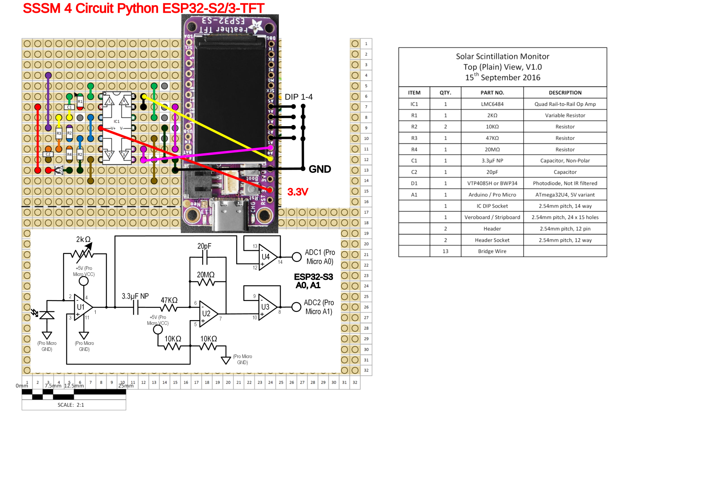

# SSSM4CircuitPython
Solar Scintillation Seeing Monitor (SSSM) for CircuitPython

A renewed verion of a SSSM for CircuitPython on a ESP32-S2 or -S3-TFT.

Project based on hardware described here
https://www.blackwaterskies.co.uk/2017/06/diy-solar-scintillation-seeing-monitor-sssm/
or originally here:
https://vdocuments.mx/an-inexpensive-solar-scintillation-seeing-monitor-circuit-an-inexpensive.html

Let me copy the intro to SSSM:

A guide to building an inexpensive Solar Scintillation Seeing Monitor. The SSSM is a handy device which monitors the atmospheric seeing conditions during solar imaging. This SSSM can be built for a fraction of the cost of commercially available devices. You can use the SSSM to monitor seeing conditions through the day, or even to control your camera to capture images during the best seeing conditions.

Background:
The original design for the SSSM was published by E. J. Seykora at the Department of Physics, East Carolina University.

Read also how to integrate with Firecapture:
http://www.firecapture.de/
http://www.joachim-stehle.de/downloads/SSSMon/SSSMonPluginManual.pdf

Adapted schematics, connected to A0 and A1 for the ESP32-S2/S3-TFT replacing the originally used arduino.



This project is based on CircuitPython Version 8 (all required Libs included for reference) running on a Adafruit ESP32-S2/S3-TFT. The S3 is faster and better suited.

Anyhwo, the new S3 seams to have issues with WiFi. WiFi is not required here in USB-Serial mode compatible with the original Firecapture SSSM plugin and interface. Anyways planns are to use for MQTT for web based publishing, this works with the ESP32-S2-TFT, even not long term stable. Causes "Wifi-OFF" Progra mhold on the S3. TDB. May be next gen/version of Circuit Python fixes it. 

Currently: CircuitPython 8.0.0-beta.6

https://circuitpython.org/board/adafruit_feather_esp32s3_tft/

Adafruit ESP32-S3 TFT Feather - 4MB Flash, 2MB PSRAM, STEMMA QT:

https://www.adafruit.com/product/5483

Pinouts:

https://learn.adafruit.com/assets/114106

Optional support for digital LUX light sensor TSL2591: Lux and Mag reading.


Read the python code.py for details ;)

1) virtual zero volt calibration (about 3.3V/2 = 0V what is apporx a reading mapped to 32768. Exact dark values can be determined in "Zero Calibration Mode". And adjusted in the code.py in the top part lines 42,43.

```
#### original build V0
Analog0InCenter   = 32603
Analog1InCenter   = 32643
```

2) Operation Modes selectable via DIP Switch in my buid on pins A2,A3,A4,A5 -- open or closed to GND.

Alternatively the modes may be set via code overide liek this:
```
# DIP SWITCH INFO
print ('Note: DIP ON (=GND) := False')
for pin in sorted(DipSW):
	DipSW[pin].switch_to_input(pull=Pull.UP)

# override or set DIP wo dip sw in place:
#DipSW['2'].switch_to_input(pull=Pull.DOWN)
DipSW['3'].switch_to_input(pull=Pull.DOWN)
```

DIP Switch Assignments are:
```
## Operation Modes
DipSW = {
	'1': DigitalInOut(board.A2),  ## Read/Write (DIP on := GND [==Logic False]) => recording to logfile / no recording
	'2': DigitalInOut(board.A3),  ## WiFi+MQTT Logging On/Off  *** disabled Use I2C Sensor
	'3': DigitalInOut(board.A4),  ## FireCapture prints/Full report prints to console
	'4': DigitalInOut(board.A5),  ## Zero Calib Info ON / OFF
	}

DipSWinfoClosed = { ## Logic "False" as DIP=ON is pin on GND
        '1': 'Record to Logfile',
        '2': 'WiFi+MQTT IoT Transmit',
        '3': 'FC Print',
        '4': 'Zero Offset Calibration',
        }

DipSWinfoOpen = { ## Logic "True" = OPEN/OFF
        '1': 'No Logging',
        '2': 'No Wifi+MQTT',
        '3': 'Long Status Print',
        '4': 'Normal Operation',
        }
```


When hooked up to USB Serial (ttyACM0,..) terminal (CuteCom, screen,... or similar):

```
--- STARTUP ---


Auto-reload is on. Simply save files over USB to run them or enter REPL to disable.
code.py output:
<0x1b>]0;<0xf0><0x9f><0x90><0x8d>Wi-Fi: off | code.py | 8.0.0-beta.6<0x1b>\<0x1b>]0;<0xf0><0x9f><0x90><0x8d>Wi-Fi: No IP | code.py | 8.0.0-beta.6<0x1b>\Note: DIP ON (=GND) := False
Dip SW 1 Off: No Logging
Dip SW 2 Off: No Wifi+MQTT
Dip SW 3 On:  FC Mode
Dip SW 4 Off: Normal Operation
I2C addresses found: ['0xb']
Battery Percent: 100.00 %
Battery Voltage: 4.18 V
WiFi OFF, no NTP auto time set.
System Start Timestamp: 2000 01 01  01:15:23
MQTT disabled.
Checking for LUX sensor TSL2591
No I2C device at address: 0x29
... none
***
Zero Cal Init: [I, R, U0, U1]    20   19 1662 1662 mV  403.4  369.5 33007.3 33012.9
Zero Offset Calibration Warning! Please check dark.
***
Actual Center:  33007  33013
Actual Center:  33007  32998
Actual Center:  33008  33011
Actual Center:  33004  33008
***
I2C addresses found: ['0xb']
A0: 0.02
A1: 9.99
D0: 10.00
C2: 0.40
A0: 0.02
A1: 9.99
D0: 10.00
C2: 0.81
A0: 0.02
A1: 9.99
D0: 10.00
C2: 1.22
A0: 0.02
A1: 9.99
```

```
Wi-Fi: off | code.py | 8.0.0-beta.6
Wi-Fi: No IP | code.py | 8.0.0-beta.6
Note: DIP ON (=GND) := False
Dip SW 1 True No Logfile
Dip SW 2 False MQTT IoT Transmit
Dip SW 3 False FC Print
Dip SW 4 False WiFi
Battery Percent: 57.40 %
Battery Voltage: 3.87 V
Connecting WiFi...
Connecting to 31A138_5G
try: NTP clock sync...
try: Sync system time to NTP...
Start Timestamp: 2023 01 13  06:51:27
MQTT Client Configuration:
MQTT: Attempting to connect to 192.168.0.20::1883
Connected to MQTT Broker!
Flags: 0
 RC: 0
Checking for LUX sensor TSL2591
No I2C device at address: 0x29
... none
A0: 1.01
A1: 0.27
C2: 0.03
MQTT publishing...
A0: 1.01
A1: 0.25
C2: 0.05
MQTT publishing...
A0: 1.01
A1: 0.26
C2: 0.08
MQTT publishing...
A0: 1.01
A1: 0.27
C2: 0.10
MQTT publishing...
A0: 1.01
A1: 0.27
C2: 0.13
MQTT publishing...
A0: 1.01
A1: 0.27
C2: 0.16
```


```
Note: DIP ON (=GND) := False
Dip SW 1 Off: No Logging
Dip SW 2 On:  WiFi+MQTT IoT Transmit
Dip SW 3 On:  FC Print
Dip SW 4 Off: Normal Operation
I2C addresses found: ['0xb']
Battery Percent: 1.40 %
Battery Voltage: 3.95 V
Connecting WiFi...
Connecting to 31A138_5G
Connected to 31A138_5G!
try: NTP clock sync...
try: Sync system time to NTP...
Start Timestamp: 2023 01 31  08:54:03
MQTT Client Configuration:
MQTT: Attempting to connect to 192.168.0.20::1883
Connected to MQTT Broker!
Flags: 0
 RC: 0
Checking for LUX sensor TSL2591
No I2C device at address: 0x29
... none
***
Zero Cal Init: [I, R, U0, U1]  -1602 -1604   40   39 mV -31814.8 -31859.6  788.2  770.0
Zero Offset Calibration Warning! Please check dark.
***
Actual Center:    788    770

*** WiFi issue here...
Wi-Fi: off | Done | 8.0.0-beta.6
Auto-reload is off.
```

